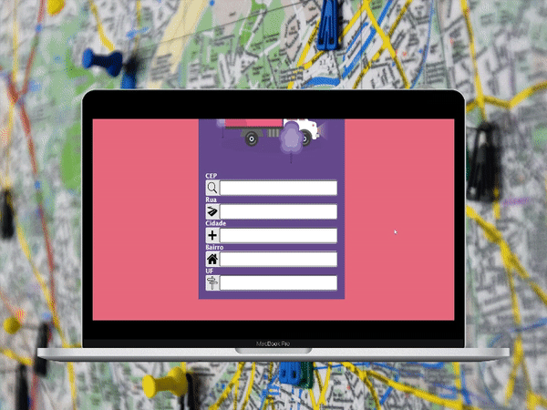
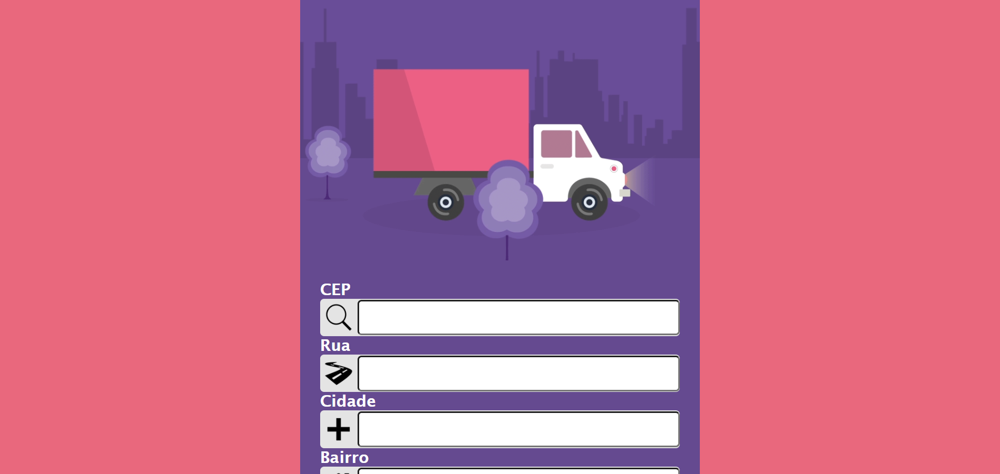

<div align="center" id="top"> 
  

&#xa0;

  <!-- <a href="https://minharua.netlify.com">Demo</a> -->
</div>

<h1 align="center">Minha Rua</h1>

<p align="center">
  

  

  

</p>

<p align="center">
  <a href="#dart-sobre">Sobre</a> &#xa0; |  &#xa0;
  <a href="#rocket-tecnologias">Tecnologias</a> &#xa0; | &#xa0;
  <a href="#white_check_mark-pré-requisitos">Pré requisitos</a> &#xa0; | &#xa0;
  <a href="#checkered_flag-começando">Começando</a> &#xa0; | &#xa0;
  <a href="#memo-licença">Licença</a> &#xa0; | &#xa0;
  <a href="https://github.com/thiilins" target="_blank">Autor</a>
</p>

<br>

 
<br>
<br>

## :dart: Sobre

Projeto desenvolvido durante a aula de consumo de API REST via back end. Consumindo BRASIL API para localização de endereço via CEP.
<br>
<br>

## :rocket: Tecnologias

As seguintes ferramentas foram usadas na construção do projeto:

- [HTML5]()
- [CSS3]()
- [JavaScript]()
- [Axios](https://axios-http.com/)
- [Node.js](https://nodejs.org/en/)
- [ExpressJS](https://expressjs.com/pt-br/)
  <br>
  <br>

## :white_check_mark: Pré requisitos

Antes de começar :checkered_flag:, você precisa ter o [Git](https://git-scm.com) e o [Node](https://nodejs.org/en/) com a extensão [LiveServer](https://marketplace.visualstudio.com/items?itemName=ritwickdey.LiveServer) instalados em sua maquina.
<br>
<br>

## :checkered_flag: Começando

```bash
# Clone este repositório
$ git clone https://github.com/thiilins/minha-rua

##### Para iniciar o frontend abra a pasta do projeto via VSCODE
$ cd minha-rua
$ code .
# Rode via live server a pasta frontend

##### Para iniciar o backend

# Entre na pasta
$ cd minha-rua/backend

# Instale as dependências
$ npm install

# Para iniciar o projeto
$ npm start

# O backend vai inicializar em <http://localhost:8000>

```

## :memo: Licença

Este projeto está sob licença MIT. Veja o arquivo [LICENSE](LICENSE.md) para mais detalhes.

Feito com :heart: por <a href="https://github.com/thiilins" target="_blank">Thiago Lins</a>

&#xa0;

<a href="#top">Voltar para o topo</a>
