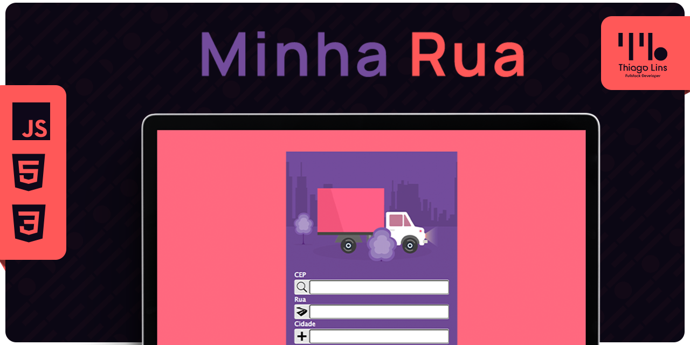

<div align="center" id="top">
  

&#xa0;

<h3>
  <a href="https://tl-minha-rua.surge.sh/">Demo (v1)</a> | 
  <a href="https://tl-minha-rua-v2.surge.sh/">Preview (v2)</a>
</h3>

</div>

<h1 align="center">Minha Rua (v2) - Multi-Ferramentas Brasil API</h1>

<p align="center">
  
  
  
</p>

<p align="center">
  <a href="#dart-sobre">Sobre</a> &#xa0; |  &#xa0;
  <a href="#sparkles-funcionalidades">Funcionalidades</a> &#xa0; |  &#xa0;
  <a href="#rocket-tecnologias">Tecnologias</a> &#xa0; | &#xa0;
  <a href="#white_check_mark-pré-requisitos">Pré requisitos</a> &#xa0; | &#xa0;
  <a href="#checkered_flag-começando">Começando</a> &#xa0; | &#xa0;
  <a href="#memo-licença">Licença</a>
</p>

<br>

## :dart: Sobre

Projeto "Minha Rua" v2! Originalmente focado no consumo da Brasil API para localização de CEP, o projeto foi totalmente reestruturado e reestilizado em uma **plataforma Multi-Page Mobile-First** moderna e vibrante.

<br>

## :sparkles: Funcionalidades

O projeto agora atua como um canivete suíço de consultas públicas, utilizando diversos endpoints da Brasil API:

1. **📍 Busca de CEP:** Consulta detalhada de endereços (Logradouro, Bairro, Cidade, UF) com formatação em tempo real.
2. **🏢 Busca de CNPJ:** Traz informações completas sobre empresas, incluindo Razão Social, CNAE, Situação Cadastral e Formatação inteligente de endereços e telefones.
3. **🌐 Busca de Domínio (.br):** Consulta em tempo real a situação de um domínio no Registro.br, mostrando servidores DNS, datas de expiração e sugestões de domínios livres.
4. **💵 Dashboard de Câmbio:** Um painel financeiro elegante para visualizar as variações (compra e venda) das cotações de moedas internacionais em datas específicas, separado por boletins ao longo do dia.

<br>

## :rocket: Tecnologias

As seguintes ferramentas foram usadas na construção do projeto:

- [HTML5]() (Multi-page App)
- [CSS3]() (Mobile-First, Variáveis, Flexbox, CSS Grid)
- [JavaScript]() (Vanilla ES6+, Fetch API, Promises)
- [Phosphor Icons]() (Ícones)
  
<br>

## :white_check_mark: Pré requisitos

Antes de começar :checkered_flag:, você precisa ter o [Git](https://git-scm.com) e o [Node](https://nodejs.org/en/) instalados em sua maquina (Opcional: usar a extensão [LiveServer](https://marketplace.visualstudio.com/items?itemName=ritwickdey.LiveServer) no VSCode).

<br>

## :checkered_flag: Começando

```bash
# Clone este repositório
$ git clone https://github.com/thiilins/minha-rua

# Acesse a pasta do projeto
$ cd minha-rua

# Abra no VSCode
$ code .

# Rode via Live Server ou inicie localmente o surge para deploy:
$ pnpx surge . tl-minha-rua-v2.surge.sh
```

## :memo: Licença

Este projeto está sob licença MIT. Veja o arquivo [LICENSE](LICENSE.md) para mais detalhes.

Feito com :heart: por <a href="https://github.com/thiilins" target="_blank">Thiago Lins</a>

&#xa0;

<a href="#top">Voltar para o topo</a>
